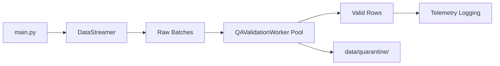

# Sentinel Ray — Automated Data Drift & QA Gatekeeper

Distributed camera telemetry ingestion with Ray Core and a Pandera-based QA validation gate.

## Phases

| Phase | Status | Description |
|-------|--------|-------------|
| 1 | Complete | Ray `DataStreamer` actor simulating 3 concurrent camera feeds |
| 2 | Complete | Distributed `QAValidationWorker` cluster with schema checks and quarantine routing |
| 3 | Planned | Drift detection and automated gate enforcement |

## What the Pipeline Does

1. Initializes a local Ray cluster
2. Streams mock batches from `camera_1`, `camera_2`, and `camera_3`
3. Routes every batch through `QAValidationWorker` actors **before** any downstream processing
4. Validates schema rules with Pandera:
   - `brightness_avg` ∈ [10.0, 255.0]
   - `blur_metric` ≥ 0
   - `camera_id` matches `^camera_\d+$`
   - `embedding` is a 128-dimensional NumPy vector
5. Quarantines failed rows to `data/quarantine/` with JSON failure metadata
6. Logs structured QA alerts and passes only valid rows to telemetry output

From **batch round 6 onward**, `camera_2` simulates hardware failure (brightness collapse + embedding drift). QA catches sub-threshold brightness and quarantines those rows.

## Project Layout

```
sentinel-ray/
├── config.py              # Paths, stream sizes, QA thresholds
├── ingestion_engine.py    # Ray DataStreamer actor
├── qa_validator.py        # Pandera schema, QAValidationWorker, quarantine logic
├── main.py                # Entry point (stream → QA → telemetry)
├── requirements.txt
├── tests/
│   ├── conftest.py
│   └── test_qa_validator.py
└── README.md
```

## Prerequisites

- Python 3.10+
- macOS, Linux, or WSL recommended for local Ray execution

## Setup

```bash
cd sentinel-ray
python3 -m venv .venv
source .venv/bin/activate   # Windows: .venv\Scripts\activate
pip install -r requirements.txt
```

## Run the Pipeline

```bash
python3 main.py
```

Expected output includes QA result lines:

```
QA RESULT | batch_round=6 | camera=camera_2 | status=failed | valid=0 | quarantined=4
QA ALERT | camera=camera_2 | batch_round=6 | quarantined_rows=4
QA RULE FAILURE | ... | column=brightness_avg | check=in_range(10.0, 255.0) | ...
```

Quarantined rows are written to:

```
data/quarantine/
├── camera_2_round006_camera_2_b006_f00_<timestamp>.json
└── camera_2_round006_camera_2_b006_f00_<timestamp>_reason.json
```

## Run Tests

```bash
pytest tests/ -v
```

The test suite covers:

- Pandera schema acceptance of valid batches
- Rejection of invalid brightness, blur, camera IDs, and embedding dimensions
- Row-level split between valid and quarantined data
- Quarantine file creation with failure metadata

## Configuration

Key settings in `config.py`:

| Setting | Default | Description |
|---------|---------|-------------|
| `BRIGHTNESS_MIN_VALID` | `10.0` | Minimum allowed brightness |
| `BRIGHTNESS_MAX_VALID` | `255.0` | Maximum allowed brightness |
| `CAMERA_ID_PATTERN` | `^camera_\d+$` | Valid camera ID regex |
| `QUARANTINE_DIR` | `data/quarantine/` | Failed row storage |
| `QA_WORKER_POOL_SIZE` | `3` | Parallel QAValidationWorker actors |
| `ANOMALY_START_BATCH` | `6` | First anomalous batch for `camera_2` |

## Architecture


