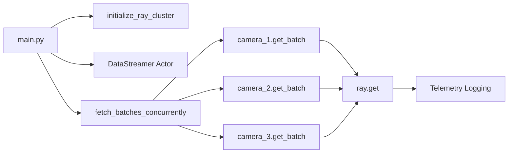

# Sentinel Ray — Phase 1: Distributed Data Ingestion

Phase 1 of the **Automated Data Drift & QA Gatekeeper** pipeline. This module implements a high-performance, distributed mock ingestion stream using **Ray Core**. Three camera sources emit telemetry batches concurrently through a stateful Ray actor.

## What Phase 1 Does

- Initializes a local Ray cluster
- Runs a `DataStreamer` Ray actor that simulates three camera feeds (`camera_1`, `camera_2`, `camera_3`)
- Each batch contains multiple frames with:
  - `timestamp`
  - `camera_id`
  - `frame_id`
  - `brightness_avg`
  - `blur_metric`
  - `embedding` (128-dimensional NumPy vector)
- Injects a controllable anomaly on **`camera_2` starting at batch 6**:
  - Brightness collapses to near zero (simulated hardware failure)
  - Embedding distribution drifts away from the healthy baseline
- Consumes **10 batch rounds** across all cameras concurrently using `ray.get()`

## Project Layout

```
sentinel-ray/
├── config.py            # Paths, stream sizes, anomaly settings, QA thresholds
├── ingestion_engine.py  # Ray init, DataStreamer actor, concurrent fetch helpers
├── main.py              # Entry point and telemetry logging
├── requirements.txt     # Python dependencies
└── README.md
```

## Prerequisites

- Python 3.10+
- macOS, Linux, or WSL recommended for local Ray execution

## Setup

Create and activate a virtual environment, then install dependencies:

```bash
cd sentinel-ray
python -m venv .venv
source .venv/bin/activate   # Windows: .venv\Scripts\activate
pip install -r requirements.txt
```

## Run Phase 1

```bash
python main.py
```

Expected behavior:

1. Ray starts a local cluster (4 CPUs by default; see `config.py`)
2. The pipeline fetches 10 rounds of batches from all three cameras in parallel
3. Structured telemetry is logged to the console for each round

### Sample Output

You should see log lines similar to:

```
2026-05-26 10:00:00,123 | INFO     | ingestion_engine | Ray cluster initialized (CPUs=4, nodes=1).
2026-05-26 10:00:00,456 | INFO     | __main__ | === Batch round 1 / 10 ===
2026-05-26 10:00:00,457 | INFO     | __main__ | camera=camera_1 | frames=4 | brightness_mean=0.6521 | ...
```

From **batch round 6 onward**, `camera_2` telemetry should show:

- `brightness_mean` and `brightness_min` near `0.02`
- `embedding_mean` shifted toward `~4.0` with higher `embedding_std`

Cameras 1 and 3 remain on the healthy baseline throughout.

## Configuration

Edit `config.py` to tune the mock stream:

| Setting | Default | Description |
|---------|---------|-------------|
| `TOTAL_BATCHES` | `10` | Number of concurrent fetch rounds |
| `FRAMES_PER_BATCH` | `4` | Frames emitted per camera per batch |
| `EMBEDDING_DIM` | `128` | Mock image embedding size |
| `ANOMALY_CAMERA_ID` | `camera_2` | Camera that fails after batch 5 |
| `ANOMALY_START_BATCH` | `6` | First anomalous batch index |
| `BRIGHTNESS_MIN_THRESHOLD` | `0.15` | Reserved for Phase 2 QA gates |

## Architecture



## Next Phases

Phase 2 will consume this stream to compute drift metrics and enforce QA gates using the thresholds defined in `config.py`.
