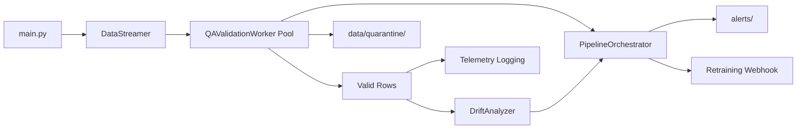

# Sentinel Ray — Automated Data Drift & QA Gatekeeper

Distributed camera telemetry ingestion with Ray Core, Pandera QA validation, statistical drift detection, and automated incident orchestration.

## Phases

| Phase | Status | Description |
|-------|--------|-------------|
| 1 | Complete | Ray `DataStreamer` actor simulating 3 concurrent camera feeds |
| 2 | Complete | Distributed `QAValidationWorker` cluster with schema checks and quarantine routing |
| 3 | Complete | Stateful `DriftAnalyzer` with KS tests and embedding distance metrics |
| 4 | Complete | `PipelineOrchestrator` circuit breaker, alerting, and retraining triggers |

See [PHASE_REPORT.md](PHASE_REPORT.md) for the full engineering log.

## What the Pipeline Does

1. Initializes a local Ray cluster
2. Streams mock batches from `camera_1`, `camera_2`, and `camera_3`
3. Routes every batch through `QAValidationWorker` actors before downstream processing
4. Sends QA-validated rows to `DriftAnalyzer` for sliding-window statistical drift checks
5. Feeds QA and drift metrics into `PipelineOrchestrator` for circuit breaker evaluation
6. Quarantines schema failures to `data/quarantine/`
7. Writes incident alerts to `alerts/` and queues simulated retraining webhook POSTs on trip

## Project Layout

```
sentinel-ray/
├── config.py              # Paths, stream sizes, QA, drift, and orchestration thresholds
├── ingestion_engine.py    # Ray DataStreamer actor
├── qa_validator.py        # Pandera schema, QAValidationWorker, quarantine logic
├── drift_detector.py      # Golden baseline, DriftAnalyzer, KS + embedding drift
├── orchestrator.py        # PipelineOrchestrator, circuit breaker, alerting, retraining
├── main.py                # Entry point (stream → QA → drift → orchestration)
├── Dockerfile             # Production container image (non-root)
├── docker-compose.yml     # Local deployment with volume mounts and resource limits
├── PHASE_REPORT.md        # Phase-by-phase engineering log
├── requirements.txt
├── tests/
│   ├── conftest.py
│   ├── test_qa_validator.py
│   ├── test_drift_detector.py
│   └── test_orchestrator.py
└── README.md
```

## Local Setup (without Docker)

```bash
cd sentinel-ray
python3 -m venv .venv
source .venv/bin/activate
pip install -r requirements.txt
python3 main.py
pytest tests/ -v
```

## Docker Deployment

Build and run the full pipeline in a container:

```bash
mkdir -p data/quarantine alerts logs
docker compose up --build
```

This will:

- Build the SentinelRay image from `Dockerfile` (Python 3.12, non-root `sentinel` user)
- Mount host directories for quarantine data, alerts, and logs
- Limit the container to 2 CPUs and 2 GB RAM
- Expose port `8265` for the Ray dashboard

Inspect outputs on the host after a run:

```
data/quarantine/   # QA-failed rows
alerts/            # Incident JSON payloads + retraining trigger records
logs/              # Application logs (when configured to file)
```

## Run Tests Inside the Container

```bash
docker compose build
docker compose run --rm sentinel-ray pytest tests/ -v
```

Or against a running container:

```bash
docker compose exec sentinel-ray pytest tests/ -v
```

## Architecture



## Key Orchestration Settings

| Setting | Default | Description |
|---------|---------|-------------|
| `QA_QUARANTINE_RATE_THRESHOLD` | `0.15` | Rolling quarantine rate that trips the breaker |
| `ORCHESTRATOR_QA_WINDOW_BATCHES` | `5` | Batch window for quarantine rate calculation |
| `DRIFT_MIN_FEATURES_FOR_INCIDENT` | `2` | Drifted features required to trip breaker |
| `RETRAINING_WEBHOOK_URL` | `http://localhost:8080/api/v1/retrain` | Simulated retraining endpoint |
| `ALERTS_DIR` | `alerts/` | Incident alert JSON output directory |

## Expected Incident Behavior

From batch round 6 onward, `camera_2` exceeds the 15% quarantine threshold. The orchestrator:

1. Trips the circuit breaker once for `camera_2`
2. Writes a structured Slack/PagerDuty-style JSON alert to `alerts/`
3. Queues an asynchronous retraining pipeline POST (saved locally if the webhook is unreachable)

Final pipeline output includes explicit incident and webhook summaries.
